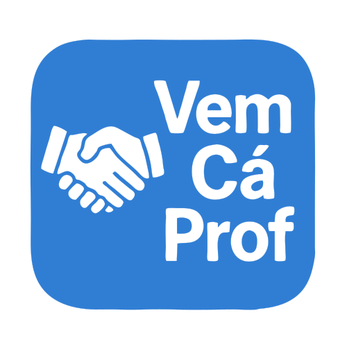

  

<strong>Conectando professores, alunos e responsáveis em um só lugar.</strong>

  Uma plataforma para organizar pessoas, horários, aulas, pagamentos e serviços educacionais.

---

## Sumário

<ul id="nav">
  <li><a href="#problema">1. O Problema</a></li>
  <li><a href="#solucao">2. A Solução</a></li>
  <li><a href="#funcionalidades">3. Principais Funcionalidades</a></li>
  <li><a href="#publico">4. Público-alvo</a></li>
  <li><a href="#tecnologias">5. Tecnologias Utilizadas</a></li>
  <li><a href="#linksuteis">6. Links Úteis</a></li>
  <li><a href="#equipe">7. Equipe</a></li>
</ul>

<h2 id="problema">1. O Problema :warning:</h2>

A busca por professores particulares e serviços de reforço escolar ainda ocorre, em muitos casos, por meio de indicações informais, redes sociais e grupos de mensagens. Esse processo torna a procura por profissionais dispersa, demorada e pouco organizada.

Alunos e responsáveis podem encontrar dificuldades para localizar professores que atendam às suas necessidades, considerando fatores como disciplina, disponibilidade de horário, localização, nível de ensino e experiência profissional.

Ao mesmo tempo, professores particulares enfrentam dificuldades para divulgar seus serviços, organizar seus horários, controlar suas aulas, acompanhar seus alunos e gerenciar os pagamentos recebidos.

A utilização de diferentes ferramentas para realizar essas atividades pode provocar conflitos de horário, perda de informações, dificuldade no acompanhamento de pagamentos e falhas na comunicação entre professores, alunos e responsáveis.

<h2 id="solucao">2. A Solução :sparkles:</h2>

Para contribuir com a solução desse problema, foi desenvolvido o <strong>VemCáProf</strong>, uma plataforma web voltada para o gerenciamento de aulas particulares e para a aproximação entre professores, alunos e responsáveis.

O sistema centraliza os principais dados necessários para a organização dos serviços educacionais, permitindo o gerenciamento de pessoas, disciplinas, cidades, horários, aulas, pagamentos e penalidades.

Professores podem manter suas informações profissionais, disciplinas e horários disponíveis. Responsáveis podem cadastrar e acompanhar seus dependentes, enquanto os alunos podem consultar suas aulas e informações vinculadas.

O VemCáProf busca tornar a rotina de aulas particulares mais simples, organizada e segura, reduzindo o uso de ferramentas separadas e facilitando o acompanhamento de todo o processo.

<h2 id="funcionalidades">3. Principais Funcionalidades :gear:</h2>

<ul>
  <li>Cadastro e autenticação de professores, responsáveis e alunos;</li>
  <li>Gerenciamento dos perfis dos usuários;</li>
  <li>Cadastro de cidades e disciplinas;</li>
  <li>Gerenciamento dos horários disponíveis dos professores;</li>
  <li>Busca e localização de professores;</li>
  <li>Agendamento de aulas particulares;</li>
  <li>Confirmação e cancelamento de aulas;</li>
  <li>Registro e acompanhamento de pagamentos;</li>
  <li>Gerenciamento de penalidades e ocorrências;</li>
  <li>Controle de acesso de acordo com o perfil do usuário;</li>
  <li>Painel administrativo com indicadores de alunos, aulas e receitas.</li>
</ul>

<h2 id="publico">4. Público-alvo :dart:</h2>

O VemCáProf tem como principal público-alvo professores particulares, alunos e responsáveis que procuram uma forma mais organizada de oferecer, encontrar e acompanhar serviços educacionais.

A plataforma também pode ser utilizada ou adaptada por escolas, cursos preparatórios, centros de reforço escolar, associações de professores e empresas de tecnologia educacional.

Entre os potenciais usuários e instituições interessadas estão:

<ul>
  <li>Professores particulares;</li>
  <li>Alunos do ensino fundamental, médio ou superior;</li>
  <li>Pais e responsáveis;</li>
  <li>Escolas públicas e particulares;</li>
  <li>Cursos preparatórios;</li>
  <li>Centros de reforço escolar;</li>
  <li>Empresas e plataformas de tecnologia educacional.</li>
</ul>

<h2 id="tecnologias">5. Tecnologias Utilizadas :computer:</h2>

<ul>
  <li>C#;</li>
  <li>.NET 8;</li>
  <li>ASP.NET Core MVC;</li>
  <li>Entity Framework Core;</li>
  <li>ASP.NET Core Identity;</li>
  <li>AutoMapper;</li>
  <li>HTML5;</li>
  <li>CSS3;</li>
  <li>JavaScript;</li>
  <li>MySQL.</li>
</ul>

<h2 id="linksuteis">6. Links Úteis :link:</h2>

  <a href="https://drive.google.com/file/d/14cP6-D0W-DF8RUnyzgO6m2mz_1yz9eLj/view" target="_blank">
    1 - Vídeo de apresentação
  </a>

  <a href="https://docs.google.com/presentation/d/1qkK3X1tXJ2FiacFfncoDWurOR1fPwbqY/edit?usp=sharing&ouid=103359255080064052765&rtpof=true&sd=true" target="_blank">
    2 - Manual de usuário
  </a>

<h2 id="equipe">7. Equipe :busts_in_silhouette:</h2>

<table align="center">
  <tr>
    <td align="center" width="200px">
      
        
      <strong>Luis Gustavo Alves Correia</strong>
       
      Desenvolvedor
    </td>
    >
    </td>
    <td align="center" width="200px">
      
        
      <strong>Álida Siqueira Perrucho Mittaraquis</strong>
       
      Desenvolvedora
    </td>
>
    <td align="center" width="200px">
      
        
      <strong>Beatriz de Souza Carvalho</strong>
       
      Desenvolvedora
    </td>
  </tr>

  <tr>
    <td align="center" width="200px">
      
        
      <strong>Gabriel Silveira Fraga</strong>
       
      Desenvolvedor
    </td>
>
    <td align="center" width="200px">
      
        
      <strong>Thiago dos Santos Lima</strong>
       
      Desenvolvedor
    </td>
  </tr>
</table>
